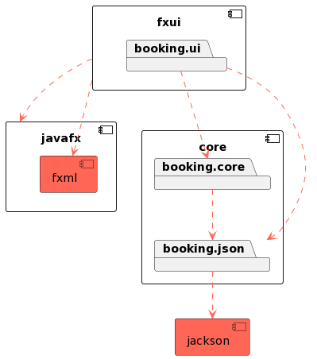

# Hotellbooking App

Dette kodingsprosjektet inneholder en hotellbookingapplikasjon som lar brukere søke etter og bestille hotellrom. Her er en oversikt over prosjektet og hvordan du kan bruke det.

## Bygging og kjøring av prosjektet

Prosjektet bruker maven til bygging og kjøring.

For å bygge, kjør `mvn install` fra rot-prosjektet (**booking-gr2313**-mappa). Dette vil kjøre alle tester og kvalitetssjekker.

For å kjøre prosjektet, må man kjøre den fra fxui mappa.

På **Mac**, gjøres dette med `cd fxui/`

Deretter, skal prosjektet kjøres med `mvn javafx:run`.

## Prosjektets Struktur

Dette prosjektet er organisert som følger:

- `docs/` - Her ligger gruppekontrakten, i tillegg til release-spesifikk dokumentasjon.
- `booking_gr2313/` - Dette er selve kodelageret for prosjektet.
    - `core/` - Her ligger hovedlogikken for prosjektet og de tilhørende testene. Innad i `core/`, er loggiken delt opp enda litt til, med at hoved logikk filene og filene som kontrollerer skriving/lesing til/fra JSON filer ligger i sine egne mapper.
    - `fxui/` - Her ligger filene for GUIen, altså fxml filer, de tilhørende kontrollerne, og tester for disse.

## Nødvendigheter for kjøring av prosjektet

Maven versjon - 4.0.0

Java versjon - 20