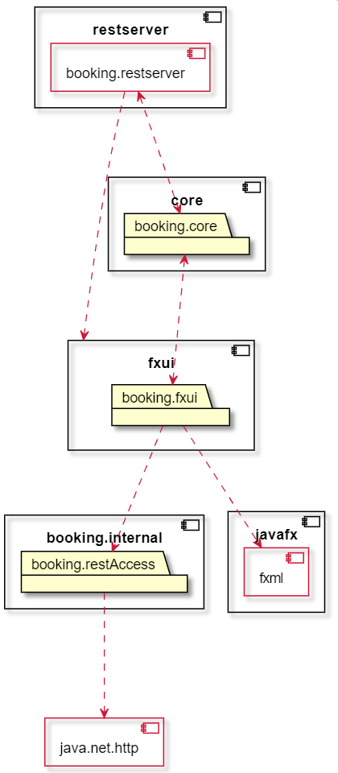

# Hotellbooking App

Dette kodingsprosjektet inneholder en hotellbookingapplikasjon som lar brukere søke etter og bestille hotellrom. Her er en oversikt over prosjektet og hvordan du kan bruke det.

## Bygging og kjøring av appen

Appen bruker **maven** til bygging og kjøring.

Her er hvordan man bygger prosjektet:

- Først, kjør `mvn clean install -PskipUITests` fra rot mappen `booking/`. Dette vil bygge appen. Her er hvordan det gjøres på **Mac** og **Linux**:
  ```
  cd booking
  mvn clean install -PskipUITests
  ```
- Deretter, lag en ny terminal fane, og kjør `mvn spring-boot:run` fra `booking/springboot/restserver/`. Dette vil starte opp serveren på port 8080. Her er hvordan det gjøres på **Mac** og **Linux**:
  ```
  cd booking/springboot/restserver/
  mvn spring-boot:run
  ```
- Så går du tilbake til den forrige terminal fanen, og kjører `mvn clean install`. Dette vil bygge appen på nytt, men denne gangen kan den også kjøre tester på GUIet. Her er hvordan det gjøres på **Mac** og **Linux**:
  ```
  mvn clean install
  ```
- Til slutt, navigerer du til `booking/fxui/`, og kjører `mvn javafx:run`. Dette vil åpne GUIet. Her er hvordan det gjøres på **Mac** og **Linux**:
  ```
  cd booking/fxui/
  mvn javafx:run
  ```

## Appens Struktur



Denne appen er organisert som følger:

- `docs/` - Her ligger gruppekontrakten, i tillegg til dokumentasjon fra hver release.
- `booking/` - Dette er selve kodelageret for prosjektet.
  - `core/src/`
    - `main/java/booking/core`
      - Her ligger hovedlogikken for appen. 
    - `test/java/booking/core`
      - Her ligger testene for hovedlogikken av appen.
  - `fxui/src`
    - `main/`
      - `java/booking/ui`
        - `internal/`
          - Her ligger serializer og deserializer filer for alle tre hovudlogikk filene våre. I tillegg, er har vi filen som håndterer tilgang til REST Serveren vår, og fungerer som en type klient til Serveren.
        - Her ligger kontroller filene for GUIen. 
      - `resources/booking/ui`
        - Her ligger fxml filene som tilsvarer hver side i appen.
    - `test/java/booking/ui`
      - `internal/`
        - Her ligger testene for serializer, deserializer, og klient filene våre.
      - Her ligger hoved GUI testen vår.
  - `springboot/restserver/src`
    - `main`
      - `java/booking/springboot/restserver/`
        - Her ligger filene for REST API-et og serveren vår.
    - `resources/booking/springboot/restserver/`
      - Her ligger 'databasen' vår, som er to json filer. En for rom, og en for brukere.
    - `test/java/booking/springboot/restserver/`
      - Her ligger testene for REST API-et og serveren vår.

## Bruk av REST API-et

REST API-et vårt er tilgjengelig på `http://localhost:8080/`.

### Her er en liste over alle `/rooms/` endepunktene:

- `POST /rooms/{roomNumber}/{roomCapacity}/{pricePerNight}` - Lager et nytt rom med gitt romnummer, kapasitet, og pris per natt.

- `GET /rooms` - Returnerer alle rom.
- `GET /rooms/{roomNumber}` - Returnerer et rom spesifikt rom.

- `PUT /rooms/{roomNumber}/update/{roomCapacity}/{pricePerNight}` - Oppdaterer et rom med gitt romnummer, kapasitet, og pris per natt.
- `PUT /rooms/{roomNumber}/book/{from}/{to}/{username}` - Booker et rom med gitt romnummer, fra dato, til dato, og brukernavn.
- `PUT /rooms/{roomNumber}/cancel/{username}/{from}{to}/{totalCostOfBooking}` - Avbooker et rom med gitt romnummer, brukernavn, fra dato, til dato, og total kostnad av bookingen.

- `DELETE /rooms/{roomNumber}` - Sletter et rom med gitt romnummer.

### Her er en liste over alle `/users/` endepunktene:

- `POST /users/{username}/{firstName}/{lastName}/{password}/{gender}` - Lager en ny bruker med gitt brukernavn og passord.

- `GET /users` - Returnerer alle brukere.
- `GET /users/{username}` - Returnerer en spesifikk bruker.
- `GET /users/{username}/bookings` - Returnerer alle bookinger til en spesifikk bruker.

- `PUT /users/{username}/{firstName}/{lastName}/{password}/{gender}` - Oppdaterer en bruker med gitt brukernavn, fornavn, etternavn, passord, og kjønn.
- `PUT /users/{username}/book/{roomNumber}/{from}/{to}/{totalCostOfBooking}` - Legger til en booking til en bruker med gitt brukernavn, romnummer, fra dato, til dato, og total kostnad av bookingen.
- `PUT /users/{username}/cancel/{roomNumber}/{from}/{to}/{totalCostOfBooking}` - Fjerner en booking fra en bruker med gitt brukernavn, romnummer, fra dato, til dato, og total kostnad av bookingen.

- `DELETE /users/{username}` - Sletter en bruker med gitt brukernavn.

## Nødvendigheter for kjøring av prosjektet

Maven versjon - 3.9.4

Java versjon - 20.0.2
