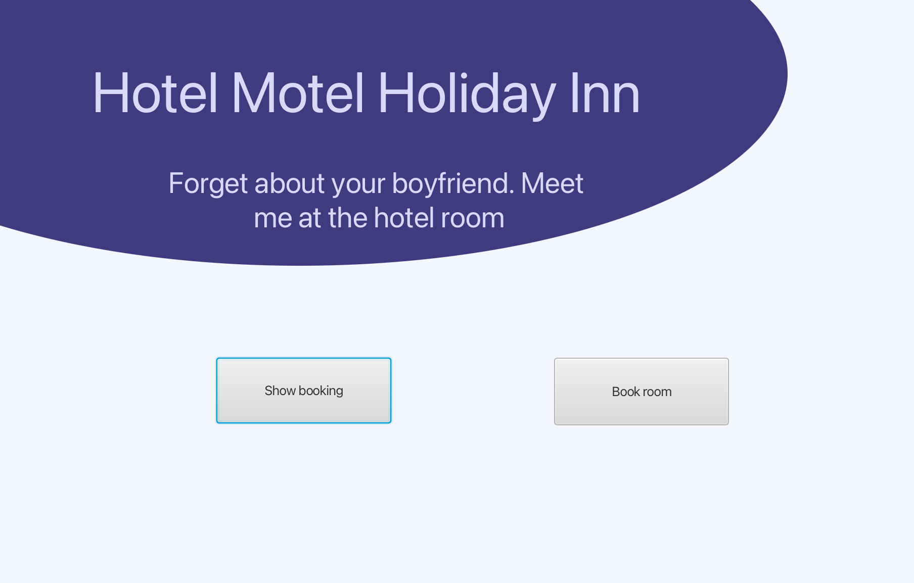

# Hotellbooking App

Dette kodingsprosjektet inneholder en hotellbookingapplikasjon som lar brukere søke etter og bestille hotellrom. Her er en oversikt over hvordan prosjektet fungerer.

## Om Hotellbooking Appen

Hotellbookingappen er utviklet for å gjøre det enkelt for brukere å søke etter ledige hotellrom og foreta en booking. Applikasjonen har følgende funksjonalitet:

### Utforske ledige rom

- På landingssiden kan brukere velge å "Book Room" for å starte søket etter tilgjengelige rom.
- Brukere kan velge innsjekkings- og utsjekkingsdatoer, antall gjester og romtype.
- Appen viser en liste over tilgjengelige rom som passer kriteriene til brukeren.
- Brukere kan velge et rom og gå videre til bookingprosessen.

### Administrere bookinger

- På landingssiden kan brukere velge "Show Bookings" for å se en liste over tidligere og kommende bookinger.
- Bookinghistorikken viser detaljer om hvert opphold, inkludert innsjekkings- og utsjekkingsdatoer, romtype og pris.
- Brukere kan klikke på en bestilling for å se flere detaljer eller få tilgang til kvitteringer og bekreftelser.
- For fremtidige bookinger kan brukere ha muligheten til å kansellere (hvis avbestillingsregler tillater det).

## Brukerhistorier

Her er en brukerhistorie som representerer en av de grunnleggende funksjonene i appen:

**Brukerhistorie 1: Utforske ledige rom (US-1)**

Som en potensiell gjest ønsker jeg å kunne se tilgjengelige hotellrom på bestemte datoer, slik at jeg kan velge og booke et rom for oppholdet mitt.
Viktig å kunne se

En landingsside med knappen "Book Room" som tar meg til bookingsiden.
En bookingside som viser en liste over tilgjengelige rom for de valgte datoene.
En oversikt over datoene jeg har valgt for oppholdet mitt.

**Viktig å kunne gjøre**

- Velge innsjekkings- og utsjekkingsdatoer.
- Se en liste over tilgjengelige rom som passer mine kriterier.
- Velge et rom og gå videre til bookingprosessen.

**Brukerhistorie 2: Se mine bookinger (US-2)**

Som en gjest ønsker jeg å kunne se en liste over mine tidligere bookinger, slik at jeg kan holde oversikt over mine kommende og tidligere opphold.
Viktig å kunne se

En landingsside med knappen "Show Bookings" som tar meg til bookingshistorikksiden.
En bookingshistorikkside som viser en liste over mine tidligere og kommende bookinger.
Informasjon om hvert opphold, inkludert innsjekkings- og utsjekkingsdatoer, romtype og pris.

**Viktig å kunne gjøre**

Klikke på en bestilling for å se flere detaljer om oppholdet.
Få tilgang til kvitteringer og bekreftelser for hver bestilling.
Eventuelt kansellere en fremtidig booking (hvis avbestillingsregler tillater det).

**Brukerhistorie 3: Avbestille og Rebestille (US-3)**

Som en gjest som har feilaktig booket feil dato, ønsker jeg å kunne avbestille min nåværende booking og deretter enkelt kunne bestille på nytt med de riktige datoene.
Viktig å kunne se

- En landingsside med alternativet "Mine Bookinger" som tar meg til bookingshistorikksiden.
- En oversikt over mine eksisterende bookinger med detaljer om innsjekkings- og utsjekkingsdatoer.
- En knapp som gir mulighet for avbestilling.

**Viktig å kunne gjøre**

- Velge en bestilling som jeg vil avbestille.
- Umiddelbart etter avbestilling, få muligheten til å bestille på nytt med korrekte datoer.

**Scenario:**
1. Jeg logger inn på profilen min og navigerer til "Mine Bookinger".
2. Jeg identifiserer feil booking og velger alternativet for avbestilling.
3. Etter avbestilling blir jeg ledet tilbake til bookingsiden, der jeg enkelt kan starte en ny booking med riktige datoer.

**Brukerhistorie 4: Bestille Rom for To Forskjellige Tidsperioder (US-4)**

Som en gjest som ønsker å bestille et rom for to separate tidsperioder, ønsker jeg å kunne legge til flere oppholdsdatoer i én enkelt booking, slik at jeg kan planlegge et fleksibelt opphold.
Viktig å kunne se

- En bookingsside som gir mulighet for å legge til flere tidsperioder for et enkelt rom.
- En oversikt over de valgte datoene og tilgjengeligheten for hvert opphold i bestillingen.

**Viktig å kunne gjøre**

- Velge innsjekkings- og utsjekkingsdatoer for det første oppholdet.
- Legge til et ekstra opphold i samme bookingssesjon med separate innsjekkings- og utsjekkingsdatoer.
- Se en pris for bookingen basert på de valgte tidsperiodene.
- Gjennomføre en enkelt betaling for hele bookingen.

**Scenario:**
1. Jeg går til bookingssiden og velger innsjekkings- og utsjekkingsdatoer for mitt første opphold.
2. Systemet viser tilgjengelige rom og priser for den valgte perioden.
3. Etter å ha valgt rommet, ønsker jeg å legge til et ekstra opphold.
4. Jeg velger innsjekkings- og utsjekkingsdatoer for det andre oppholdet.
5. Jeg bekrefter bookingen og ser to separate bookinger for samme rom på forskjellige datoer, som jeg ville.

Disse brukerhistoriene gir en oversikt over de grunnleggende funksjonalitetene i hotellbookingappen din. Du kan utvide og tilpasse dem etter behov, avhengig av prosjektets omfang og krav.