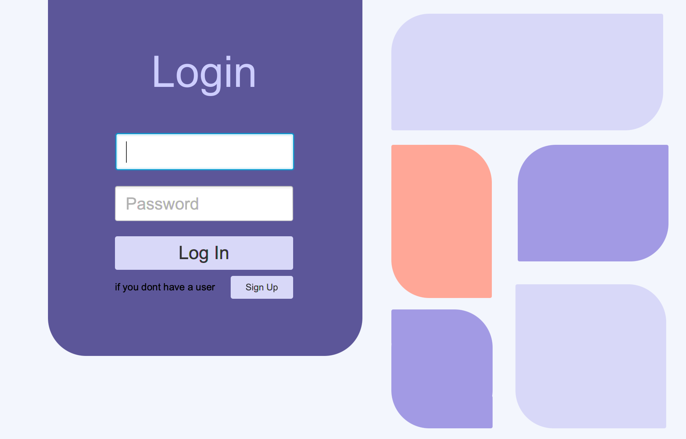
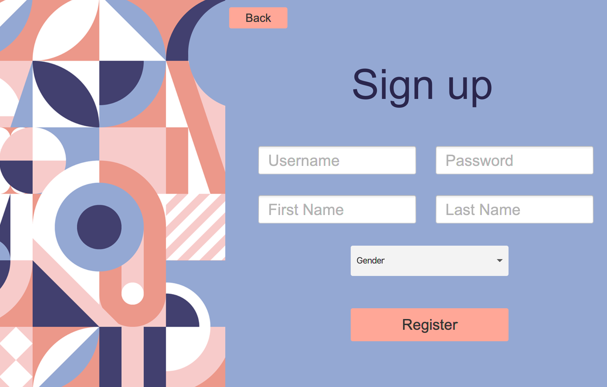
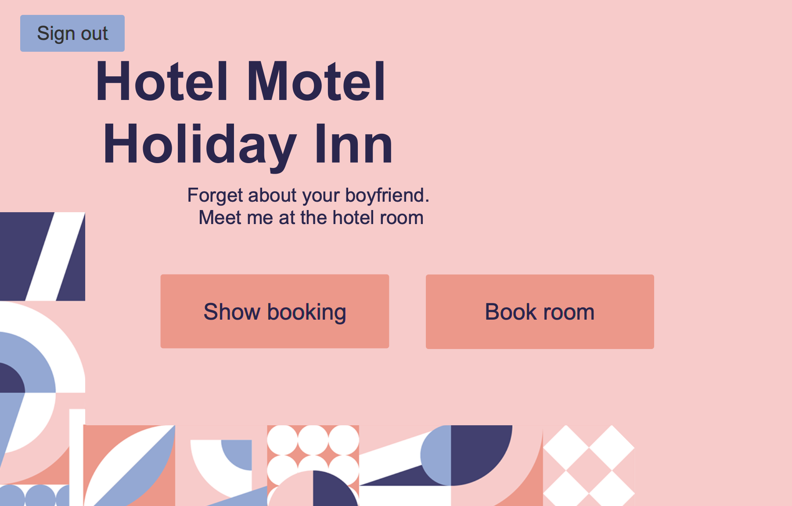
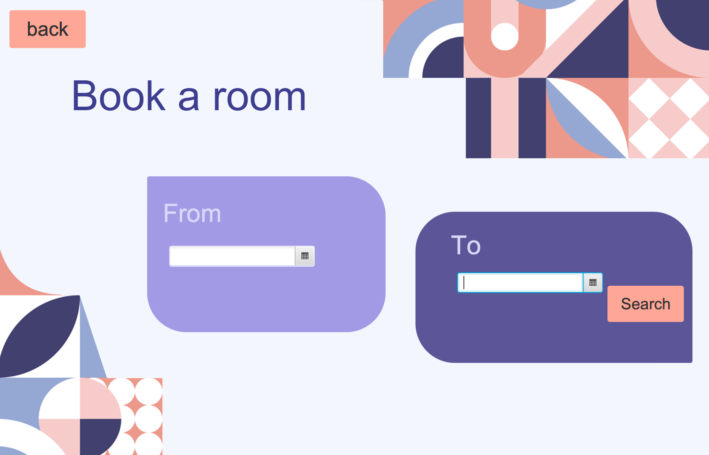
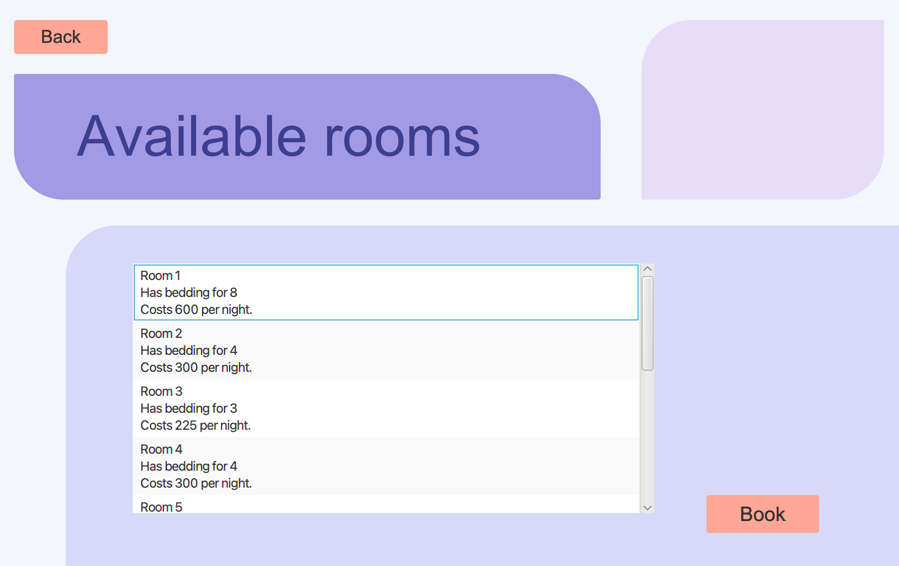
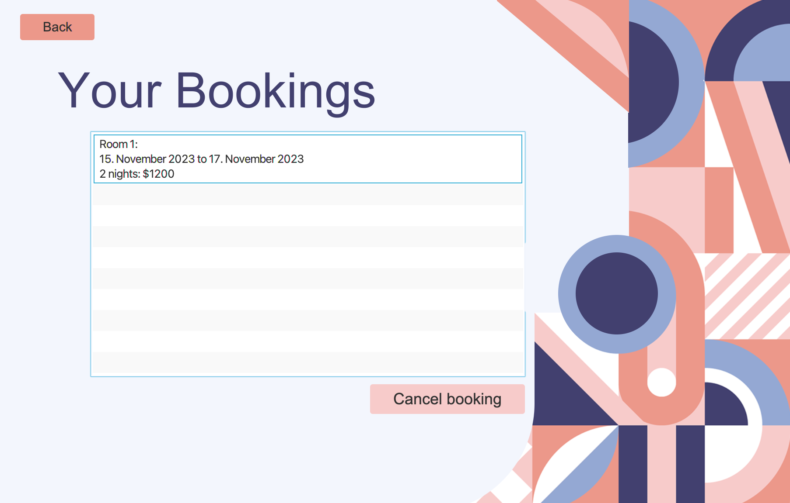

# Hotellbooking App

Dette kodingsprosjektet inneholder en hotellbookingapplikasjon som lar brukere søke etter og bestille hotellrom. Her er en oversikt over hvordan prosjektet fungerer.

## Om Hotellbooking Appen

Hotellbookingappen er utviklet for å gjøre det enkelt for brukere å søke etter ledige hotellrom og foreta en booking. Applikasjonen har følgende funksjonalitet:

### Logg inn

På landingsiden enten velge å logge inn med en eksisterende bruker, eller registrere en ny bruker.

### Registrere ny bruker

Her kan brukere registrere en ny bruker ved å fylle inn ønsket brukernavn og passord, fornavnet sitt, etternavnet sitt og kjønnet sitt.

### Hovedsiden

På hovedsiden har brukere to valg. De kan enten søke etter ledige rom, eller se en liste over bookingene sine.

### Søk for ledige rom

På søkesiden kan brukere velge innsjekkings- og utsjekkingsdatoer. Når brukere trykker på "Search" vil de få opp en liste over ledige rom som passer kriteriene deres.

### Booke et rom

Her kan brukeren se en liste over ledige rom som passer kriteriene deres. Brukere kan booke et rom ved å trykke på "Book" knappen.

### Brukeren sine bookings

Her kan brukere se en liste over bookingene sine. De kan også kansellere en bookin om de angrer ved å trykke på "Cancel booking" knappen.

## Brukerhistorier

Her er to brukerhistorie som representerer noen av de grunnleggende funksjonene i appen:

### Brukerhistorie 1: Utforske ledige rom (US-1)

Som en potensiell gjest ønsker jeg å kunne se tilgjengelige hotellrom på bestemte datoer, slik at jeg kan velge og booke et rom for oppholdet mitt.
Viktig å kunne se

En landingsside med knappen "Book Room" som tar meg til bookingsiden.
En bookingside som viser en liste over tilgjengelige rom for de valgte datoene.
En oversikt over datoene jeg har valgt for oppholdet mitt.

**Viktig å kunne gjøre**

- Velge innsjekkings- og utsjekkingsdatoer.
- Se en liste over tilgjengelige rom som passer mine kriterier.
- Velge et rom og gå videre til bookingprosessen.

### Brukerhistorie 2: Se mine bookinger (US-2)

Som en gjest ønsker jeg å kunne se en liste over mine tidligere bookinger, slik at jeg kan holde oversikt over mine kommende og tidligere opphold.
Viktig å kunne se

En landingsside med knappen "Show Bookings" som tar meg til bookingshistorikksiden.
En bookingshistorikkside som viser en liste over mine tidligere og kommende bookinger.
Informasjon om hvert opphold, inkludert innsjekkings- og utsjekkingsdatoer, romtype og pris.

**Viktig å kunne gjøre**

- Klikke på en bestilling for å se flere detaljer om oppholdet.
- Få tilgang til kvitteringer og bekreftelser for hver bestilling.
- Eventuelt kansellere en fremtidig booking (hvis avbestillingsregler tillater det).

Disse brukerhistoriene gir en oversikt over de grunnleggende funksjonalitetene i hotellbookingappen din. Du kan utvide og tilpasse dem etter behov, avhengig av prosjektets omfang og krav.
